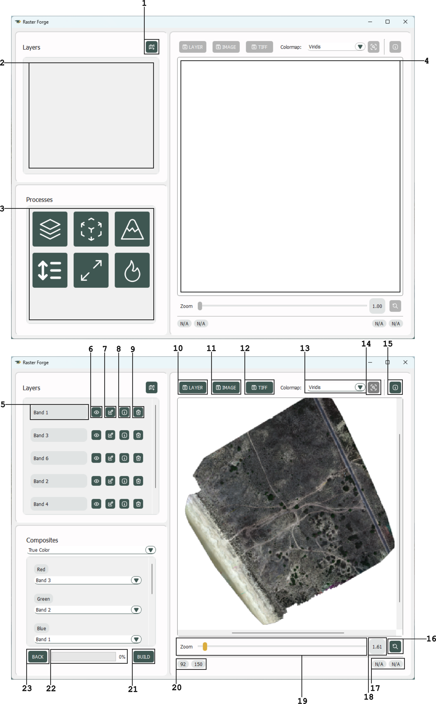
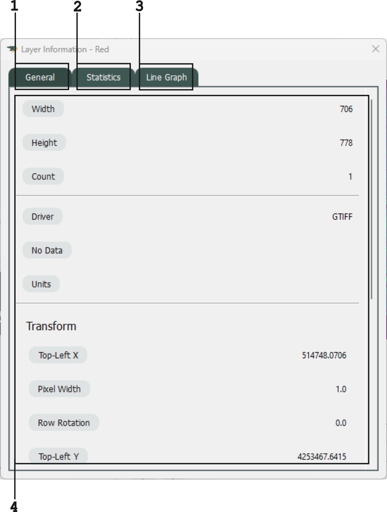

Component Map
=============

Main Winow
----------

1. Import :py:class:`Layer <rforge.lib.containers.layer.Layer>` Button
2. :py:class:`Layer <rforge.lib.containers.layer.Layer>` List Panel
3. Processes Panel
4. Viewer Panel
5. :py:class:`Layer <rforge.lib.containers.layer.Layer>` Name
6. :py:class:`Layer <rforge.lib.containers.layer.Layer>` View Button
7. :py:class:`Layer <rforge.lib.containers.layer.Layer>` Name Edit Button
8. :py:class:`Layer <rforge.lib.containers.layer.Layer>` Information Button
9. :py:class:`Layer <rforge.lib.containers.layer.Layer>` Delete Button
10. Save Viewer :py:class:`Layer <rforge.lib.containers.layer.Layer>` in the :py:class:`Layer <rforge.lib.containers.layer.Layer>` Collection Button
11. Save Viewer :py:class:`Layer <rforge.lib.containers.layer.Layer>` as GeoTIFF Button
12. Save Viewer :py:class:`Layer <rforge.lib.containers.layer.Layer>` (w/ Colormap) as PNG Button
13. Colormap Selector
14. Pixel Value on Cursor Toggle
15. Viewer :py:class:`Layer <rforge.lib.containers.layer.Layer>` Information Button
16. Reset Zoom Button
17. Coordinates in CRS (if Designated)
18. Zoom Ratio
19. Zoom Bar
20. Coordinates in Pixels (if Available)
21. Build Process Button
22. Process Progress Bar (WIP)
23. Return to Main Process Panel Button

Layer Import Window
-------------------

.. image:: maps/import.png
    :align: center
    :width: 800
    :alt: Layer Import Window Map

1. File Path
2. File Selector Button
3. Scale Indicator Button
4. File Band Panel
5. Predicted Raster Size (According to Scale)
6. Band Import Selector Box
7. Band Name (Editable)
8. Import Bands Button
9. Import Progress Bar (WIP)

Layer Information Window
------------------------

1. General Information Tab
2. Statistical Information Tab
3. :py:class:`Layer <rforge.lib.containers.layer.Layer>` Values Line Graph Tab
4. Contents Panel