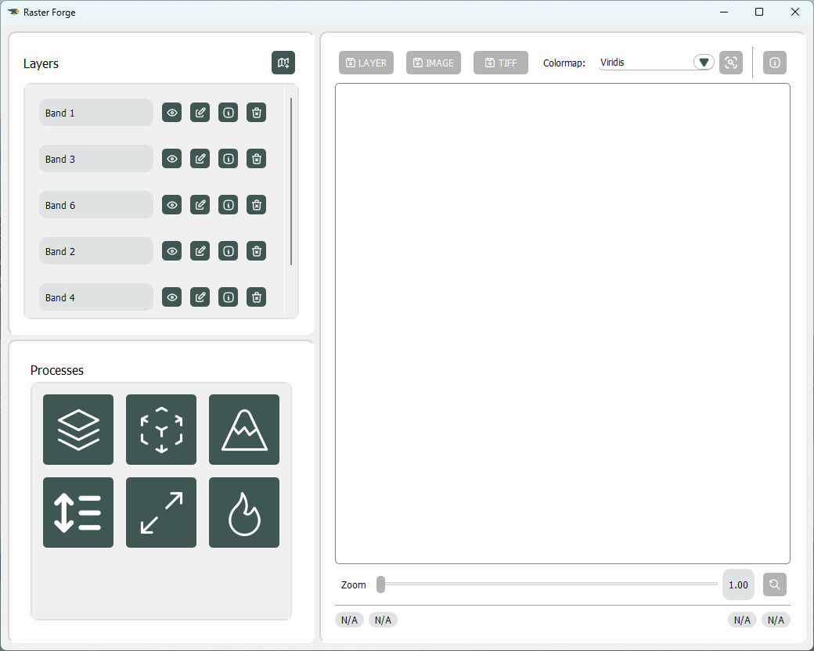

Quick Tutorial
==============

This is quick walkthrough tutorial on utilizing the graphical user interface. In this case, we will use it to generate a true-color composite and an NDVI (Normalized Difference Vegetation Index).

1. Firstly, to initiate the graphical user interface, we enter the following command in a console:

.. code-block:: bash

    rforge

2. With the GUI initialized, we can now proceed.

.. image:: tutorial/init.png
    :align: center
    :width: 800
    :alt: GUI Initialized

3. We begin by opening the :py:class:`Layer <rforge.library.containers.layer.Layer>` Import Window.

.. image:: tutorial/import.png
    :align: center
    :width: 800
    :alt: Layer Import Window

4. Now, we'll select a file by clicking the file selector button and choose an appropriate scale. Afterward, we'll designate the bands to import along with their identifying names. Finally, we initiate the import process by clicking on the import button.

.. image:: tutorial/import-alt.png
    :align: center
    :width: 800
    :alt: Layer Import Window (w/ Selected Bands)

5. All the imported bands are now usable in the :py:class:`Layers <rforge.library.containers.layer.Layer>` panel

6. We can now proceed with the process generation. Firstly, we'll select the *Composite* button in the *Processes* panel. Then, from the dropdown selector, we'll choose the preset for a true-color composite. Next, we'll populate the options with the required :py:class:`Layers <rforge.library.containers.layer.Layer>` and click *Build*. The resulting composite should appear in the viewer on the right-hand side. This result can be freely saved as a :py:class:`Layer <rforge.library.containers.layer.Layer>` for further use or exported as GeoTIFF or PNG.

.. image:: tutorial/process-composite.png
    :align: center
    :width: 800
    :alt: GUI Main Window (w/ Composite Result)

7. Now, let's navigate *Back* from the *Composite* panel to the main *Processes* panel. Here, we'll opt for the *Multispectral Index* button instead. From the dropdown menu, we have a wide selection of indices to choose from, and for this demonstration, we'll select the NDVI. Once again, we'll fill in the options with the necessary :py:class:`Layers <rforge.library.containers.layer.Layer>` and click *Build*. The resulting output should now display in the viewer on the right-hand side.

.. image:: tutorial/process-index.png
    :align: center
    :width: 800
    :alt: GUI Main Window (w/ NDVI Result)